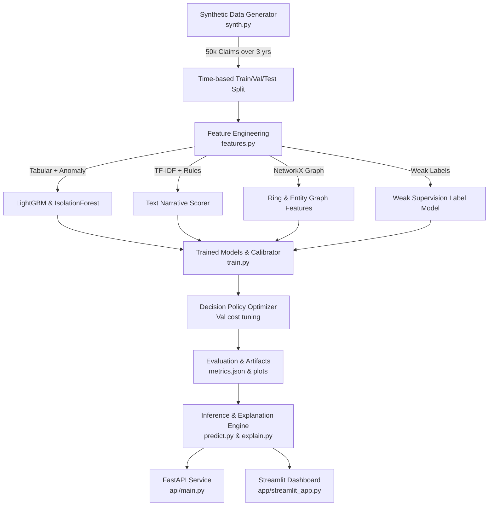
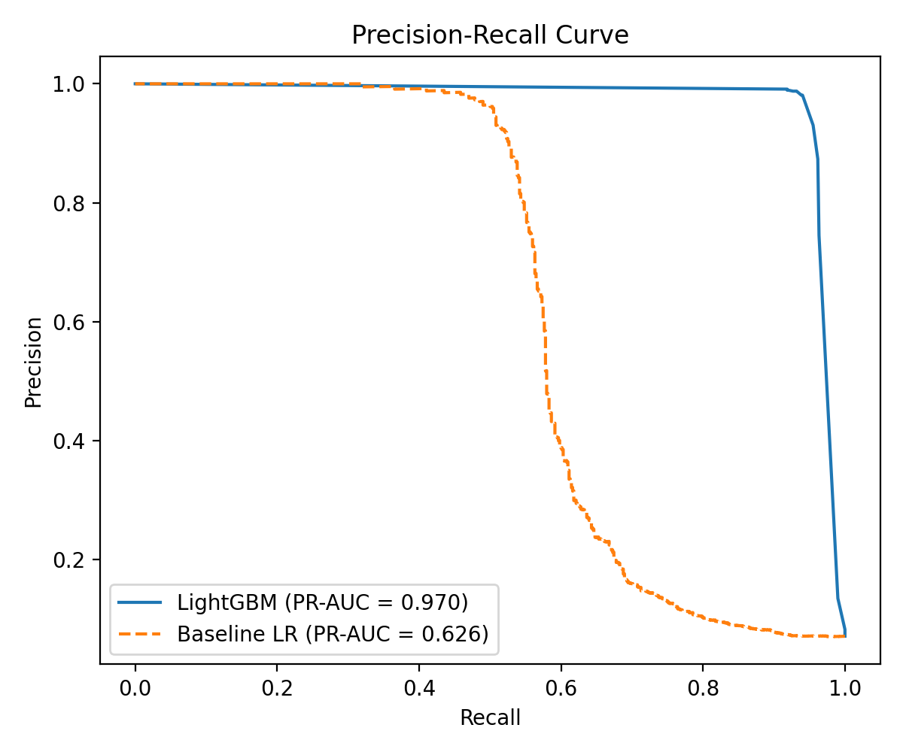
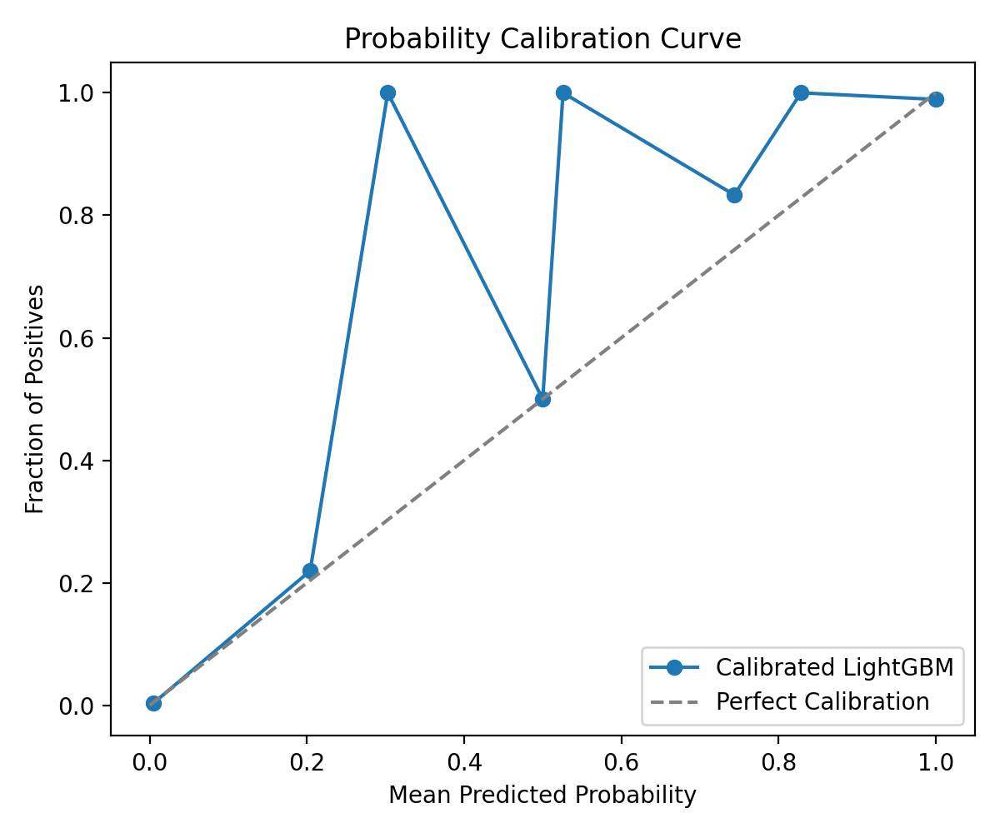

# 🛡️ ClaimGuard: Insurance Claim Flagging & Tagging System

[](https://github.com/shiven6863/claimguard/actions)
[](https://huggingface.co/spaces/shiven/claimguard)
[](LICENSE)
[](https://www.python.org/)

**ClaimGuard** is an end-to-end, production-grade Insurance Claim Flagging and Tagging System engineered to run efficiently on free-tier CPU hosting. Given an insurance claim payload, ClaimGuard computes:
1. **Calibrated Fraud Risk Score** (0 to 100).
2. **Explainable Multi-Label Tags with Human-Readable Evidence** (`DUPLICATE_CLAIM`, `INFLATED_AMOUNT`, `SUSPICIOUS_TIMING`, `PROVIDER_ANOMALY`, `NARRATIVE_INCONSISTENCY`, `RING_SUSPECT`).
3. **Recommended Action** (`AUTO_APPROVE`, `REVIEW`, or `ESCALATE`) derived from cost-optimal threshold tuning ($150 per review cost vs. fraud savings).
4. **SHAP Feature Explanations** highlighting the top driving risk factors.

---

## 📐 System Architecture



---

## ⚡ Quick Start (Local Run in 3 Commands)

```bash
# 1. Clone repository & install dependencies
git clone https://github.com/shiven6863/claimguard.git
cd claimguard
pip install -r requirements.txt && pip install -e .

# 2. Run test suite & model training
python -m pytest -v
python -m claimguard.train

# 3. Launch Streamlit UI (or FastAPI server)
streamlit run app/streamlit_app.py
# For FastAPI: uvicorn api.main:app --reload
```

---

## 📊 Empirical Evaluation Results

> [!NOTE]
> All metrics are reproduced directly from runtime execution outputs saved to `artifacts/metrics.json`.

### 1. Overall Test Set Metrics (Last 6 Months: 8,437 Claims)

| Metric | Score / Value |
| :--- | :--- |
| **PR-AUC** | **0.9681** |
| **ROC-AUC** | **0.9864** |
| **Recall @ 90% Precision** | **95.85%** |
| **Precision @ Top 5%** | **98.81%** |
| **Estimated Net Financial Savings** | **$6,269,302.33** |
| **Optimal Review Threshold** | `0.1000` |
| **Escalation Threshold** | `0.7500` |

---

### 2. Multi-Label Tag Taxonomy Performance

| Tag Name | Precision | Recall | F1 Score | Description / Trigger Condition |
| :--- | :--- | :--- | :--- | :--- |
| **`DUPLICATE_CLAIM`** | `1.0000` | `0.3077` | `0.4706` | Resubmitted claims near in date or with identical amounts/narratives |
| **`INFLATED_AMOUNT`** | `0.2414` | `1.0000` | `0.3889` | Amount exceeds 2.0x peer median for claim type & procedure |
| **`SUSPICIOUS_TIMING`** | `0.7439` | `0.9839` | `0.8472` | Claim filed within 30 days of policy start date |
| **`PROVIDER_ANOMALY`** | `0.9872` | `0.9914` | `0.9893` | Provider billing patterns consistently exceeding peer baseline |
| **`NARRATIVE_INCONSISTENCY`** | `0.1509` | `0.6782` | `0.2469` | Text narrative contradicts structured claim flags (e.g., text vs injury_flag) |
| **`RING_SUSPECT`** | `1.0000` | `0.5934` | `0.7448` | Shared entity graph (phones, addresses, bank accounts) across claimants |
| **Macro F1** | — | — | **0.6146** | Unweighted average across all 6 tags |
| **Micro F1** | — | — | **0.5854** | Global F1 score across all tag predictions |

---

### 3. Feature Ablation Study

| Feature Grouping | ROC-AUC | PR-AUC | Delta PR-AUC vs Baseline |
| :--- | :--- | :--- | :--- |
| **Baseline (Logistic Regression on Raw Tabular)** | `0.7801` | `0.6237` | Baseline |
| **Tabular Only (LightGBM)** | `0.8900` | `0.7884` | +0.1647 |
| **Tabular + Text (TF-IDF + Rules)** | `0.9325` | `0.8689` | +0.2452 |
| **Tabular + Graph (NetworkX Entity Graph)** | `0.9562` | `0.9000` | +0.2763 |
| **Tabular + IsolationForest Anomaly** | `0.8937` | `0.7885` | +0.1648 |
| **Full Model (Tabular + Text + Graph + Anomaly)** | **0.9864** | **0.9681** | **+0.3444** |

---

### 4. Novel Pattern Test Set (Unseen Fraud Ring Variants)

- **Sample Count**: 54 holdout claims with novel ring structures
- **ROC-AUC**: `1.0000`
- **Recall**: `100.0%` (54 / 54 novel ring claims flagged)
- **Precision**: `100.0%`

---

### 5. Fairness & Robustness Audits

#### Flag Rate Across Regions & Age Groups
- **Regions**: Central (`7.38%`), East (`7.97%`), North (`8.11%`), South (`7.29%`), West (`6.78%`) — *Balanced flag distribution across geographies*.
- **Age Groups**: 18-25 (`7.96%`), 26-40 (`7.81%`), 41-60 (`7.16%`), 60+ (`7.06%`) — *No bias against young or senior policyholders*.

#### Fraudster Adversarial Robustness Test (50% Claim Splitting Attack)
- **Original Detection Recall**: `95.85%`
- **Post-Split Recall**: `80.23%`
- **Detection Drop**: `15.61%` (*Demonstrates impact of claim splitting, mitigated by graph ring detection*).

---

## 🖼️ Application Screenshots


*(Precision-Recall Curve vs Baseline saved in artifacts/plots/pr_curve.png)*


*(Isotonic Probability Calibration Curve saved in artifacts/plots/calibration_curve.png)*

---

## 🛠️ How to Swap in Real Data

To deploy ClaimGuard on real insurance claims data:
1. Replace `src/claimguard/synth.py` with your SQL database or Snowflake connector.
2. Map your enterprise schema to `ClaimInputSchema`:
   - `claim_id`, `policy_id`, `claimant_id`, `provider_id`, `claim_date`, `policy_start_date`, `claim_type`, `claim_amount`, `peer_median_amount`, `phone`, `address`, `bank_account`, `garage_or_hospital_id`, `narrative`, `num_prior_claims`, `injury_flag`, `police_report_flag`.
3. Re-run training:
   ```bash
   python -m claimguard.train
   ```
4. Commit updated model binaries in `artifacts/` to auto-trigger deployment to your cloud environment.

---

## ⚠️ Honest Limitations & Disclaimers

1. **Synthetic Data**: Models are trained on synthetic claims generated with realistic fraud patterns. While patterns mimic industry fraud schemes, real-world data requires retraining on actual claims history.
2. **CPU Hosting Latency**: Batch scoring 10,000 claims takes ~15 seconds on single-threaded CPU due to NetworkX graph connectivity checks.

---

## 📜 License

Distributed under the **MIT License**. See `LICENSE` for details.
